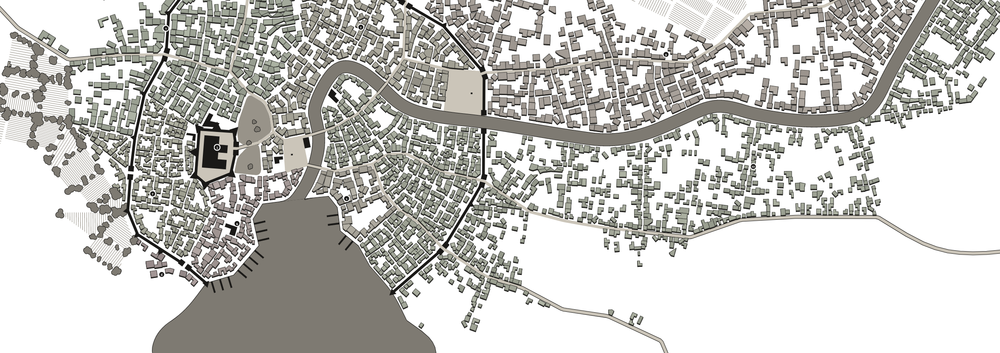
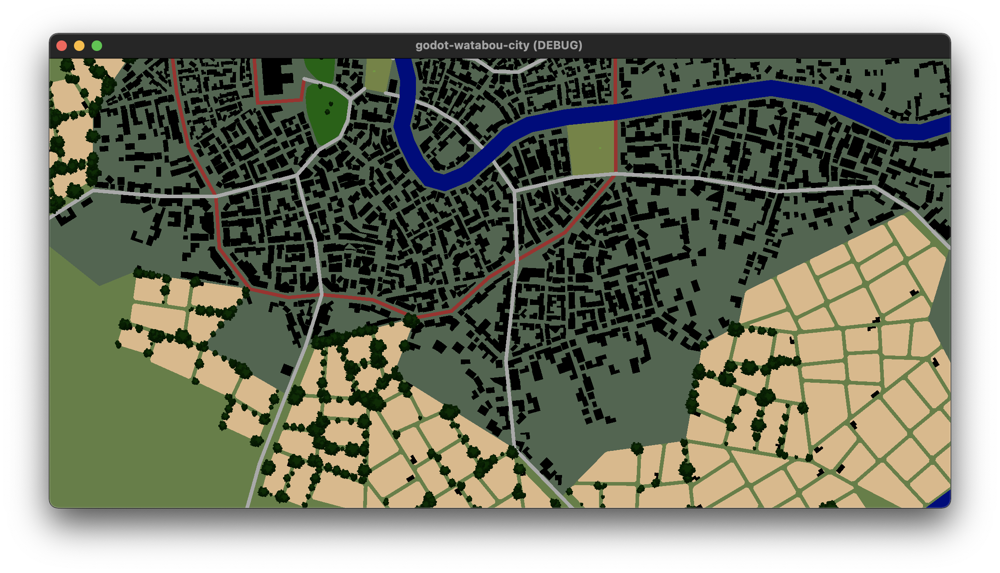

# Table of Contents

1.  [Usage](#org7ef4c63)

Load and manipulate city-scapes from the awesome [Watabou City Generator](https://watabou.github.io/city-generator)

<a id="org7ef4c63"></a>

# Usage

1.  Install addon

Only the `/addons/godot-watabou-city` is required to use this addon
Any other files here except for the license can be removed.

```gdscript

func _ready():
    var map = WatabouCity.create_from_json("trunwick.json")
    map.draw_all(self)
```

## Screenshot


